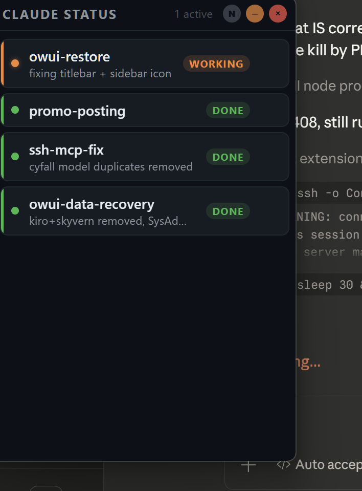

# Claude Status Dashboard

A real-time desktop widget that shows what your Claude Code sessions are doing. Lives in your system tray and floats over your desktop — one glance tells you which conversations are working, thinking, done, or errored.

  



## How It Works

```
Claude Code ──MCP──▶ server.js ──HTTP POST──▶ widget.cjs ──SSE──▶ widget.html
   (your AI)          (stdio)       :7890        (Electron)        (renderer)
```

1. **`server.js`** — An MCP server that Claude Code connects to. Exposes `set_status` and `clear_status` tools.
2. **`widget.cjs`** — An Electron app that runs an HTTP server on port 7890, receives status updates, and renders them in a frameless overlay window.
3. Each Claude Code session gets a row in the widget showing its status (`working`, `thinking`, `done`, `error`, `idle`) with live updates via Server-Sent Events.

## Setup

### 1. Install

```bash
git clone https://github.com/Idevelopusefulstuff/claude-status-dashboard.git
cd claude-status-dashboard
npm install
```

### 2. Configure Claude Code

Add the MCP server to your Claude Code config (`~/.claude/settings.json` or project-level):

```json
{
  "mcpServers": {
    "claude-status": {
      "command": "node",
      "args": ["/full/path/to/claude-status-dashboard/server.js"]
    }
  }
}
```

### 3. Add Instructions

Add this to your `CLAUDE.md` so Claude uses the widget automatically:

```markdown
## Status Dashboard (MCP: claude-status)
- Call `mcp__claude-status__set_status` at the start and end of every response
- Start: `status: "working"`, `label: "what you're doing"`
- End: `status: "done"`
- Pick a short `chat_id` on first response, reuse it for the whole conversation
```

### 4. Launch the Widget

```bash
npm start
```

Or use the included `launch.vbs` on Windows to start it without a console window.

## Features

- **System tray icon** — click to show/hide, right-click for position options
- **Always-on-top overlay** — frameless, resizable, draggable
- **Position presets** — top-right, top-left, bottom-right, bottom-left via tray menu
- **Desktop notifications** — get notified when a session finishes or errors (toggle with the N button)
- **Dismiss chats** — hover and click X to clear finished sessions
- **Auto-reconnect** — SSE connection recovers automatically if interrupted
- **Multi-session** — tracks multiple Claude Code sessions simultaneously

## Widget Controls

| Button | Action |
|--------|--------|
| **N** | Toggle desktop notifications on/off |
| **–** | Minimize to system tray |
| **×** | Quit the app |

## Status Colors

| Status | Color | Meaning |
|--------|-------|---------|
| `working` | Orange | Claude is actively executing |
| `thinking` | Purple | Claude is planning or researching |
| `done` | Green | Response complete |
| `error` | Red | Something went wrong |
| `idle` | Gray | Session is idle |

## MCP Tools

### `set_status`
Update or create a chat status entry.

| Parameter | Type | Required | Description |
|-----------|------|----------|-------------|
| `chat_id` | string | yes | Unique session identifier |
| `status` | enum | yes | `idle`, `working`, `thinking`, `done`, `error` |
| `label` | string | no | Short description of current activity |

### `clear_status`
Remove a chat from the dashboard.

| Parameter | Type | Required | Description |
|-----------|------|----------|-------------|
| `chat_id` | string | yes | Session to remove |

## Browser Dashboard

A standalone browser-based dashboard is also included at `dashboard.html`. If you prefer a browser tab over the Electron widget, you can point the MCP server's HTTP endpoint at it — both consume the same SSE stream on `http://127.0.0.1:7890/events`.

## Auto-Start on Windows

To launch automatically on login, create a shortcut to `launch.vbs` in your Startup folder:

```
%APPDATA%\Microsoft\Windows\Start Menu\Programs\Startup
```

## License

MIT
